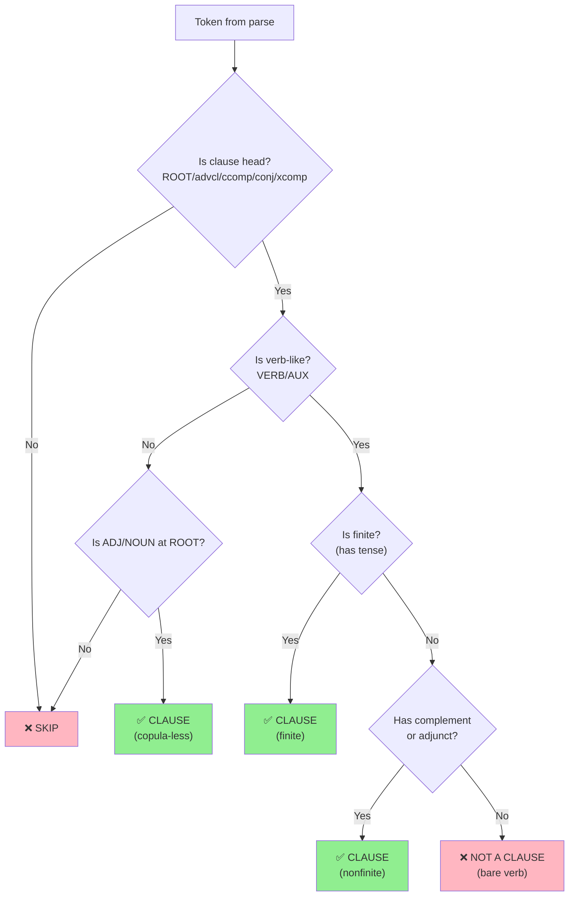
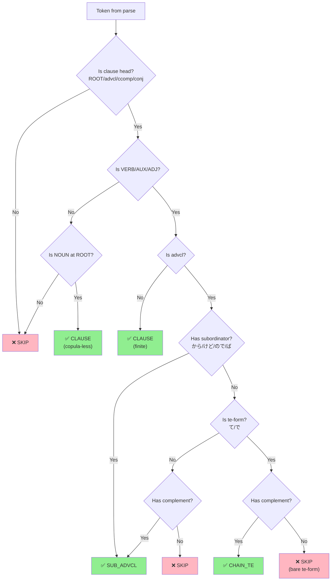

# Clause Segmentation Methodology

**Last Updated:** 2026-02-04

This document explains the Vercellotti & Hall (2024) clause coding rules and how they are implemented in our English and Japanese clause segmentation pipelines.

> **Status:** Both implementations follow Vercellotti & Hall (2024), except coordinated VPs use a stricter rule (own complement required, not shared).

## 1. Theoretical Foundation: Vercellotti & Hall (2024)

### 1.1 Core Argument

Vercellotti & Hall (2024) argue for a **broader definition of clause** in L2 research that includes:
- Finite clauses (traditional definition: subject + finite verb)
- Coordinated verb phrases with complements/adjuncts
- Nonfinite clauses with complements/adjuncts
- Verbal small clauses
- Copula-less predicates (common in L2 speech)

### 1.2 Key Principle: "Verb + Element"

The central rule is that a verbal construction reaches **clause status** when it has:
> A verb (finite or nonfinite) **plus** a complement or adjunct

This creates complexity comparable to finite clauses and should be counted for CAF measures.

### 1.3 Summary of Vercellotti Rules

| Construction | Clause Status | Condition |
|--------------|---------------|-----------|
| Finite clause with subject | ✅ Yes | Always |
| Coordinated VP | ✅ Yes | If has complement/adjunct (shared OK per Vercellotti) |
| Shared modal VP (e.g., "would be patient and comfort me") | ✅ Yes | Counts even with shared complement |
| Shared complement VP (e.g., "encourage and accompany me") | ✅ Yes | Counts per Vercellotti (shared "me") |
| Nonfinite clause (infinitive, gerund, participle) | ✅ Yes | If has complement/adjunct |
| Verbal small clause (e.g., "see them open the basket") | ✅ Yes | If verb has complement/adjunct |
| Copula-less predicate (e.g., "it different from China") | ✅ Yes | Describes a state |
| Verbless small clause (e.g., "make them happy") | ❌ No | No overt verb |
| Bare coordinated verb (no complement) | ❌ No | No additional element |

### 1.4 Minor Clauses

Stance markers like "I think" can function as:
1. **Matrix verb** (taking a complement clause) → count as clause
2. **Epistemic hedge** (adverb-like) → tag as MINOR for separate analysis

---

## 1.5 Visual: English Clause Detection



---

## 1.6 Visual: Japanese Clause Detection



**Example (Japanese):**
```
映画を見て家に帰った
  │      │
  │      └── 帰った (ROOT) → IND
  │
  └── 見て (advcl, te-form, has obj:映画を) → CHAIN_TE

Result: 2 clauses
```

```
走って転んだ
  │      │
  │      └── 転んだ (ROOT) → IND
  │
  └── 走って (advcl, te-form, NO complement) → SKIP

Result: 1 clause (bare te-form merged)
```

---

## 2. English Implementation

**File:** `en/scripts/textgrid_caf_segmenter_v2.py`  
**NLP Model:** spaCy with `en_core_web_trf` or custom L2 model

### 2.1 Algorithm Overview

```
Input: Text (from TextGrid word tier)
    ↓
Step 1: Preprocessing
    - Remove fillers (uh, um, er, ah, etc.)
    - Collapse exact repetitions (disfluency handling)
    ↓
Step 2: Sentence Segmentation
    - Use wtpsplit (SaT/WtP) for unpunctuated L2 speech
    - Enforce sentence boundaries as clause boundaries
    ↓
Step 3: Dependency Parsing (spaCy)
    - Parse each sentence
    - Extract POS tags, dependency relations
    ↓
Step 4: Clause Head Detection
    - Find all verb-like tokens (VB*, VERB, AUX)
    - Find tokens with copula children
    - Sort by syntactic depth (deepest first)
    ↓
Step 5: Clause Classification
    - Classify each head by dependency relation
    - Apply Vercellotti rules for clause status
    ↓
Step 6: Token Collection
    - Collect tokens belonging to each clause
    - Avoid overlap with other clause heads
    ↓
Output: List of (start, end, type, text, token_indices)
```

### 2.2 Clause Head Detection (English)

```python
def is_verb_like(token) -> bool:
    return (token.tag_.startswith('VB') or
            token.pos_ in {'VERB', 'AUX'} or
            'VB' in token.tag_)  # Catches EX_VBZ, etc.

def has_copula_child(token) -> bool:
    for child in token.children:
        if child.dep_ == 'cop':
            return True
        # Heuristic: catch mis-parsed copulas (e.g., "i'm sorry")
        if child.dep_ == 'nsubj' and child.text.lower() in ["'m", "'re", "'s", "is", "are", "was", "were"]:
            return True
    return False
```

### 2.3 "Verb + Element" Check (English)

```python
def has_complement_or_adjunct(verb_token) -> bool:
    """Vercellotti's key rule: verb must have additional element."""
    for child in verb_token.children:
        dep = child.dep_
        # Complements
        if dep in {'obj', 'iobj', 'ccomp', 'xcomp', 'attr', 'oprd', 'dative', 'dobj'}:
            return True
        # Oblique arguments
        if dep.startswith('obl'):
            return True
        # Adjuncts
        if dep in {'advmod', 'npadvmod', 'prep', 'pobj', 'agent'}:
            return True
    return False
```

### 2.4 Clause Classification (English)

| Dependency | Clause Type | Condition |
|------------|-------------|-----------|
| `ROOT` (verb) | `independent` | Always |
| `ROOT` (ADJ/NOUN) | `independent` | With copula child |
| `ROOT` (ADJ/NOUN) | `independent_copula_less` | Without copula |
| `ROOT` + stance verb | `minor` | think/believe/etc. with ccomp |
| `conj` (verb) | `coordinated_vp` | **Must have OWN complement/adjunct**† |
| `advcl` | `subordinate_advcl` | VBG/VBN requires complement |
| `ccomp` | `subordinate_ccomp` | Always |
| `acl` | `subordinate_acl` | VBG/VBN requires complement |
| `acl:relcl` | `subordinate_acl:relcl` | Always |
| `relcl` | `subordinate_relcl` | Always |
| `xcomp` | `nonfinite_xcomp` | Requires complement/adjunct |
| `csubj` | `subordinate_csubj` | Always |
| VBG/VBN (other) | `nonfinite_participle` | Requires complement/adjunct |
| `parataxis` | `parataxis` | Always |

†Note: This is stricter than Vercellotti's inclusive approach for shared-complement cases (e.g., "encourage and accompany me"). See `VERCELLOTTI_COMPLIANCE_ISSUES.md` for details.

### 2.5 MINOR Stance Verb Tagging

Stance verbs like "I think" are tagged as `minor` when they take a complement clause:

```python
# Stance verbs tagged as MINOR (per Vercellotti)
MINOR_STANCE_LEMMAS = {'think', 'believe', 'guess', 'suppose', 'know', 'feel', 'mean'}

# In clause detection:
if token.dep_ == 'ROOT' and token.lemma_.lower() in MINOR_STANCE_LEMMAS:
    if any(ch.dep_ == 'ccomp' for ch in token.children):
        clause_type = 'minor'  # Tag separately for analysis
```

**Example:**
```
"I think she is happy"
  → Clause 1: [minor] "I think"
  → Clause 2: [subordinate_ccomp] "she is happy"
```

### 2.6 Strict Coordinated VP Rule

Coordinated verbs only count as separate clauses if they have their **own** complement:

```python
# en/scripts/textgrid_caf_segmenter_v2.py (lines 437-440)
elif token.dep_ == 'conj' and self.is_verb_like(token):
    # V&H rule: coordinated VP is a clause ONLY if it has its OWN complement/adjunct
    if self.has_complement_or_adjunct(token):  # NOT "or head"
        clause_type = 'coordinated_vp'
```

**Examples:**
```
"I sang and danced"           → 1 clause (bare verbs, no complements)
"I took my car and danced"    → 1 clause (only head has complement)
"I took my car and went home" → 2 clauses (each has own complement)
```

---

## 3. Japanese Implementation

**File:** `ja/ja_clause_segmenter.py`  
**NLP Model:** GiNZA (`ja_ginza` or `ja_ginza_electra`)

### 3.1 Japanese-Specific Considerations

Japanese differs from English in several key ways:

| Feature | English | Japanese |
|---------|---------|----------|
| Word order | SVO | SOV (verb-final) |
| Subject | Usually overt | Often omitted (pro-drop) |
| Subordination marking | Conjunction before clause | Verb suffix/particle after verb |
| Te-form chains | N/A | Common (Vて...Vて...V) |
| Copula | Required | Often omitted |
| Finite/nonfinite | Clear distinction | Less clear (verb forms) |

### 3.2 Algorithm Overview (Japanese)

```
Input: Text (transcript)
    ↓
Step 1: Filler Removal
    - Remove Japanese fillers (えー, あの, うーん, etc.)
    - Preserve character positions for restoration
    ↓
Step 2: Sentence Segmentation
    - Use wtpsplit (WtP) for unpunctuated speech
    - Japanese-specific model weights
    ↓
Step 3: Dependency Parsing (GiNZA)
    - Universal Dependencies for Japanese
    - Extract POS, dependency, lemma
    ↓
Step 4: Clause Head Detection
    - Find predicates: VERB, ADJ, (NOUN for copula-less)
    - Filter out fillers and misparsed tokens
    - Sort by syntactic depth (deepest first)
    ↓
Step 5: Clause Classification
    - Apply Japanese-adapted Vercellotti rules
    - Handle te-form chains specially
    ↓
Step 6: Token Collection
    - Collect tokens for each clause
    - Handle quotative と for ccomp
    ↓
Output: List of (start, end, type, text, token_indices)
```

### 3.3 Predicate Detection (Japanese)

```python
def _is_predicate(self, tok) -> bool:
    """Check if token can be a predicate (ROOT-level)."""
    if self._is_filler_token(tok):
        return False
    return tok.pos_ in {"VERB", "ADJ", "NOUN"}

def _is_subordinate_predicate(self, tok) -> bool:
    """Stricter check for embedded clause heads."""
    if self._is_filler_token(tok):
        return False
    if tok.pos_ == "VERB":
        # Reject misparsed proper nouns
        if "名詞" in (tok.tag_ or ""):
            return False
        return True
    if tok.pos_ == "ADJ":
        # Require true i-adjective or copula support
        if "形容詞" in (tok.tag_ or ""):
            return True
        # Check for copula auxiliary
        for ch in tok.children:
            if ch.pos_ == "AUX" and ch.text in {"だ", "です"}:
                return True
        return False
    return False
```

### 3.4 "Verb + Element" Check (Japanese)

```python
def _has_complement_or_adjunct(self, tok) -> bool:
    """
    Strict 'verb + element' heuristic.
    NOTE: nsubj is NOT counted (shared/implied subjects common in Japanese).
    """
    element_deps = {"obj", "iobj", "obl", "advmod", "nmod"}
    for child in tok.children:
        if self._is_filler_token(child):
            continue
        if child.dep_ in element_deps:
            return True
    return False
```

### 3.5 Te-Form Chain Handling

Te-form (て/で) is a Japanese verb suffix used for:
- Sequential actions: 起きて、食べて、出かけた (got up, ate, went out)
- Manner: 走って帰った (ran home)
- Cause: 疲れて寝た (was tired so slept)

**Vercellotti adaptation:**
- Te-form verb **with complement/adjunct** → separate clause (CHAIN_TE)
- Te-form verb **without complement** → not a separate clause (merged)

```python
if dep == "advcl":
    # Check for explicit subordinator first (から, けど, ので, etc.)
    if self._has_explicit_subordinator(tok):
        heads.append((tok, "SUB_ADVCL"))
    elif self._has_te_mark(tok):
        # Strict Vercellotti-style: te-chain needs element
        if self._has_complement_or_adjunct(tok):
            heads.append((tok, "CHAIN_TE"))
        # else: skip (bare te-form, not a clause)
    else:
        if self._has_complement_or_adjunct(tok):
            heads.append((tok, "SUB_ADVCL"))
```

### 3.6 Clause Classification (Japanese)

| Dependency | Clause Type | Condition |
|------------|-------------|-----------|
| `ROOT` | `IND` | VERB/ADJ/NOUN predicate |
| `ROOT` + stance verb | `MINOR` | 思う/考える with ccomp |
| `acl` | `SUB_REL` | Relative clause |
| `ccomp` | `SUB_CCOMP` | Complement clause |
| `xcomp` | `SUB_XCOMP` | Rare in Japanese |
| `advcl` + subordinator | `SUB_ADVCL` | から/けど/ので/etc. |
| `advcl` + te-form + element | `CHAIN_TE` | て/で with complement |
| `conj` + element | `COORD` | Coordinated predicate |
| `parataxis` | `PARA` | Parenthetical |

### 3.7 Japanese Subordinators

```python
def _has_explicit_subordinator(self, tok) -> bool:
    """Detect common overt subordinators."""
    subordinators = {
        "から",    # because
        "ながら",  # while
        "つつ",    # while (literary)
        "けど",    # but/although
        "けれど",  # but/although
        "が",      # but
        "なら",    # if
        "ば",      # if/when
        "と",      # when/if
        "し",      # listing reasons (V1し V2し V3)
    }
    for child in tok.children:
        if child.dep_ == "mark" and child.text in subordinators:
            return True
        # Handle ので/のに (の + で/に)
        if child.text == "の" and child.dep_ == "mark":
            for g in child.children:
                if g.dep_ == "fixed" and g.text in {"で", "に"}:
                    return True
    return False
```

### 3.8 Japanese Filler Handling

```python
_filler_text = {
    "えー", "え", "あー", "あ", "んー", "うーん", "えっと", "ええと",
    "まー", "まあ", "そのー", "その", "あのー", "あの", "ねー", "ね",
    "うん", "ふーん", "へー", "はい", "ええ",
}

def _is_filler_token(self, tok) -> bool:
    if tok.text in self._filler_text:
        return True
    if "フィラー" in (tok.tag_ or ""):
        return True
    if tok.dep_ == "discourse" and tok.pos_ in {"INTJ", "SYM"}:
        return True
    return False
```

---

## 4. Validation Rules (Post-Processing)

Both pipelines apply post-processing validation to filter problematic clauses:

### 4.1 English Validation

| Rule | Action |
|------|--------|
| Very short clause (<2 words) | Remove if no clear verb |
| Filler-only | Remove |
| No verb detected | Remove |

### 4.2 Japanese Validation

| Rule | Threshold | Action |
|------|-----------|--------|
| Fragment | <3 chars | Remove |
| Short non-predicate | 3 chars, no VERB/ADJ | Remove |
| Particles-only | を/に/が/で only | Remove |
| Meta-speech | ＪＪＥ, お願いします | Remove |
| No-predicate | no verb/adj, <10 chars | Remove |
| Bare te-form | no complement, <12 chars | Remove |
| Very long | >60 chars | Truncate at space |
| MINOR exemption | stance markers | Keep regardless |

---

## 5. Comparison: English vs Japanese

| Aspect | English | Japanese |
|--------|---------|----------|
| **NLP Model** | spaCy (en_core_web_trf) | GiNZA (ja_ginza_electra) |
| **Sentence Segmentation** | wtpsplit (SaT/WtP) | wtpsplit (WtP) |
| **Predicate POS** | VERB, AUX | VERB, ADJ, NOUN |
| **Clause Boundary** | Sentence-first | Sentence-first |
| **Key Subordination** | advcl, ccomp, acl, xcomp | advcl (て/から/etc.), ccomp, acl |
| **Special Handling** | Coordinated VP | Te-form chains |
| **Copula-less** | Rare in L2 | Common |
| **Fillers** | uh, um, er | えー, あの, うーん |

---

## 6. Output Format

Both pipelines output clauses in the same format:

```python
(start_token_idx, end_token_idx, clause_type, clause_text, token_indices)
```

### Example (English)
```
(0, 5, 'independent', 'I took my father car', [0, 1, 2, 3, 4])
(5, 10, 'coordinated_vp', 'and went to different city', [5, 6, 7, 8, 9])
```

### Example (Japanese)
```
(0, 6, 'IND', 'ケンさんは公園に行きました', [0, 1, 2, 3, 4, 5])
(6, 9, 'SUB_REL', '犬が食べた', [6, 7, 8])
```

---

## 7. References

- Vercellotti, M. L., & Hall, S. (2024). Coding all clauses in L2 data: A call for consistency. *Research Methods in Applied Linguistics, 3*, 100132.
- Foster, P., Tonkyn, A., & Wigglesworth, G. (2000). Measuring spoken language: A unit for all reasons. *Applied Linguistics, 21*, 354–375.
- Hunt, K. W. (1965). A synopsis of clause-to-sentence length factors. *The English Journal, 54*(4), 300-309.
